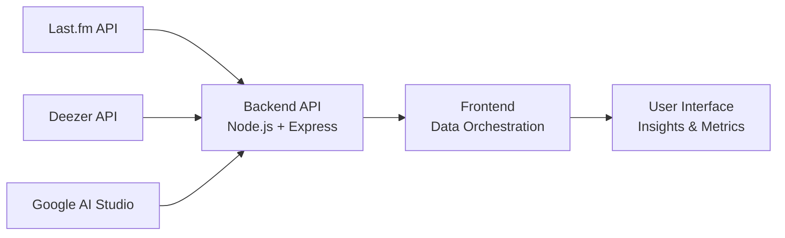

# Artist Insight

**Artist Insight** is a frontend-focused mini-app that demonstrates how **LLM-driven analysis** can be combined with a clean, responsive interface to transform raw artist metrics into **clear, interpretable insights**.

The core of the project is not the metrics themselves, but the **LLM-powered interpretation layer** that turns raw data into meaningful signals for decision-making.

**Live demo:** https://artist-insight.vercel.app

---

## 📱 Responsive Preview

While designed for desktop usage (B2B context), the interface is fully responsive. The layout automatically adapts to tablets and mobile browsers to ensure data readability across all devices.

  

---

## 📖 Project Overview

Artist Insight explores a simple question:

> How can we make artist performance metrics immediately understandable, without relying on heavy dashboards or manual analysis?

Rather than exposing dozens of raw numbers, the app combines:

- a **small, curated set of metrics**
- a **Large Language Model**
- a **clear UI**

to produce **concise, structured insights** that highlight performance trends, key drivers, and potential opportunities or risks.

This project was built as a **personal learning project** with a strong focus on frontend architecture, responsive layout, and AI-assisted interfaces.

> This project is not intended for artist discovery.
> It assumes prior familiarity with the artist and focuses on performance interpretation rather than recommendation.

---

## 🧠 LLM-Centered Approach

The LLM is the **central component** of the application.

Metrics alone are not the end product : they serve as structured input for the model, which generates:

- a high-level performance summary
- the main factors influencing the results
- potential opportunities or warning signals

Special attention was given to:

- prompt structure
- output consistency
- readability and usefulness of generated insights
- UX around loading states and incomplete data

The interface exists to **support and contextualize the LLM output**, not the other way around.

---

## 📊 Metric Selection Rationale

> Metrics reflect the latest data available from external APIs at request time.

Only **five core metrics** are displayed intentionally:

- Total listeners
- Total plays
- Engagement (plays per listener)
- Top track
- Top track share

This choice reflects several constraints and decisions:

- The **Last.fm API provides limited and sometimes biased data**, making metric quality more important than quantity.
- Engagement (plays per listener) helps distinguish between visibility and actual audience loyalty.
- Top track share gives quick insight into catalog concentration.
- A reduced metric set improves readability and avoids dashboard overload.

The goal is not exhaustive analytics, but **fast signal detection**.

---

## 🎯 Core Features

- Artist search
- Key metric display with minimal visual noise
- LLM-generated structured insights
- Plays-per-track bar chart for quick trend scanning
- Copy-to-clipboard for easy reuse in reports or discussions

---

## Data Flow Overview

> All external data sources are accessed through a single backend API (exposing three routes), then consumed and projected by the frontend UI.

## 🛠️ Tech Stack

- **Frontend:** React, TypeScript, Vite
- **Styling:** Tailwind CSS (custom layout, no design system)
- **APIs:**
  - Last.fm API for artist metrics and top tracks
  - Deezer API as a fallback source for artist images
- **LLM:** Gemini 2.5 Flash (Google AI Studio)
- **Backend:** Node.js, Express
- **Deployment:** Vercel (frontend), Render (backend)

---

## ⚙️ Frontend & Product Decisions

### Layout & Styling

- Built the layout **from scratch** using Tailwind CSS
- Constraint-driven design (sidebar, content zones, responsive stacking)
- Desktop-first B2B interface with responsive adaptations for mobile
- No design system used intentionally, to focus on CSS fundamentals and layout control

### React Architecture

- Centralized state management in parent components
- Clear separation between UI components and logic
- Use of custom hooks for:
  - artist search and data fetching
  - LLM interaction and insight generation
- Explicit data mapping layer between API responses and UI-ready data models

### Visual Choices

- Artist images are included to humanize the data and improve visual engagement
- Deezer API is used as a supplement due to missing or unreliable images in the Last.fm API

---

## 🧪 Challenges & Learnings

- Handling external API limitations (CORS, incomplete data, multiple endpoints)
- Designing a responsive layout without predefined UI components
- Structuring React components for clarity and maintainability
- Mapping imperfect API data into stable, typed frontend models
- Designing prompts and UI states to ensure usable AI-generated outputs

---

## 🚧 Known Limitations & Next Steps

### Current limitations

- Metrics reflect **current snapshot data** only, without historical evolution
- No standardized scale (e.g. monthly listeners vs. lifetime metrics)
- Insight quality depends on the consistency and bias of source data

### Potential improvements

- Historical tracking and trend comparison over time
- Artist-to-artist benchmarking to provide clearer performance context
- Metric normalization to improve cross-genre comparison
- Configurable insight depth depending on use case
  configurable insight depth

---

### ⚠️ Performance Note

The first search after a period of inactivity may take longer than usual. This is due to the cold start behavior of the backend.

Subsequent searches are faster, as the backend remains active for a short period after the first request.

---

## 📬 Contact

Feel free to reach out if you have questions, feedback, or want to discuss the project.

**Lucrèce Fodouop**  
📧 [lfodouop@gmail.com](mailto:lfodouop@gmail.com)
